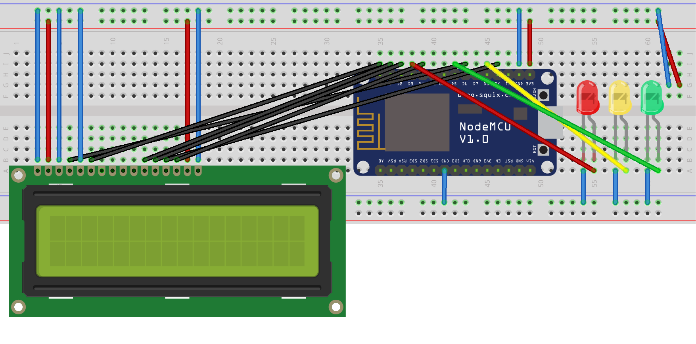
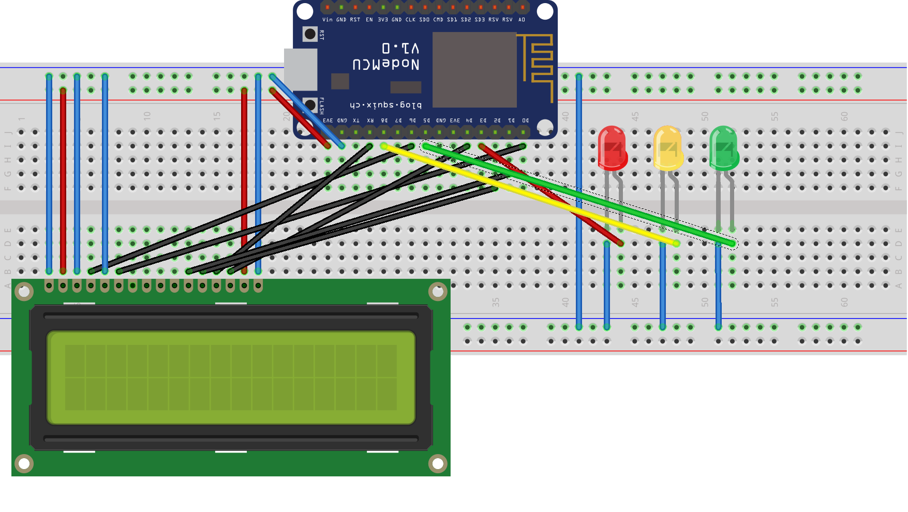

# Whistleblower bot
Програмное обеспеченье для отслеживания количества сообщений от пользователя и соответсвующей световой индикации для микроконтроллера NodeMCU v3.
Для запуска вам понадобится:
- Модуль NodeMCU v3 на базе чипа esp8266
- Жидкокристаллический дисплей 16х2 (советую брать с модулем I2C)
- 3 светодиода
- Перемычки нужного вам разьема
- Макетная плата

# Подключение

